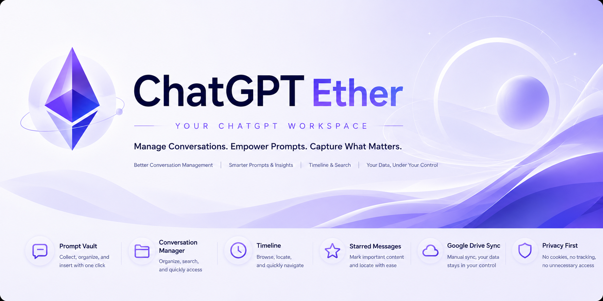

# ChatGPT Ether

Language: **English** | [中文](./README.zh-CN.md)



ChatGPT Ether is a Chrome extension for personal ChatGPT conversation management.

It is not a chatbot and does not replace ChatGPT. The goal is to add a lightweight personal workspace on top of the ChatGPT web app: manage prompts, organize conversations, star important messages, view the current conversation timeline, and optionally sync safe metadata to your own Google Drive.

> This project is still in an early stage. It is recommended for personal use or small-scale testing.

## Features

### Prompt Vault

- Save reusable prompts
- Search prompts
- Tags and favorites
- Insert prompts into the current ChatGPT input box
- JSON import / export

### Conversation Management

- Save the current ChatGPT conversation to a local index
- Organize saved conversations with folders
- Search saved conversations
- Add notes to conversations
- Open saved conversations from the extension

### Timeline and Current Conversation Search

- Show a right-side timeline on ChatGPT conversation pages
- Locate user messages and assistant replies
- Search within the current conversation
- Use ChatGPT page-native message identifiers where possible to reduce incorrect jumps

### Starred Messages

- Star important messages in the current conversation
- View starred messages from the extension
- Open the corresponding conversation and locate the message area

### Floating Workspace

- Add a draggable floating entry on the ChatGPT page
- Quickly open Prompt Vault, Conversation Management, and Starred Messages
- Show or hide the page timeline

### Manual Google Drive Sync

- Uses Google Drive `appDataFolder`
- Supports manual upload to cloud
- Supports download and merge from cloud
- Syncs extension data such as prompts, folders, conversation index, and starred-message metadata

### Diagnostics

- Inspect current page recognition status
- Inspect current conversationId, title, and message counts
- Inspect timeline, starred-message, and sync status
- Copy diagnostics text for troubleshooting

## What It Does Not Do

ChatGPT Ether intentionally keeps a narrow boundary:

- Does not call ChatGPT private APIs
- Does not read cookies
- Does not read browsing history
- Does not request `all_urls`
- Does not upload full chat transcripts
- Does not sync full chat transcripts
- Does not automatically scan all historical conversations
- Does not delete or hide ChatGPT native conversations
- Does not pretend to be an official OpenAI product

## Installation

The current version is intended to be built from source and loaded as an unpacked extension.

### 1. Clone the Repository

```bash
git clone https://github.com/dowevip/chatgpt-ether.git
cd chatgpt-ether
```

### 2. Install Dependencies

If Bun is installed globally:

```bash
bun install
```

If Bun is not installed globally:

```bash
npx --yes bun@latest install
```

### 3. Build the Chrome Extension

```bash
bun run build:chrome
```

Or:

```bash
npm run build:chrome
```

The build output is:

```text
dist_chrome
```

### 4. Load in Chrome

1. Open `chrome://extensions/`
2. Enable Developer mode
3. Click "Load unpacked"
4. Select the `dist_chrome` directory

## Update

If you have already cloned the repository:

```bash
git pull origin main
npm run build:chrome
```

Then open `chrome://extensions/` and click "Reload" on the ChatGPT Ether extension card.

## Google Drive Sync

Google Drive sync is currently manual.

Data that may be synced:

- Prompt Vault data
- Folder structure
- Conversation index
- Conversation notes
- Starred-message metadata
- Extension settings
- Necessary time metadata

Data that is not synced:

- Full chat transcripts
- Full assistant replies
- Attachments
- Images
- Canvas content
- Screenshots
- Large raw conversation JSON

The sync file is stored in your own Google Drive `appDataFolder`, which normally does not appear in the regular Drive file list.

## Privacy

ChatGPT Ether reads the necessary structure of the currently opened ChatGPT page to build the timeline, search the current conversation, locate messages, and show diagnostics.

Extension data is stored locally by default. Only when you explicitly use Google Drive sync will the allowed sync data be uploaded to your own Google Drive.

The extension does not sell user data, does not upload full chat transcripts to third-party services, and does not read cookies or browsing history.

See [PRIVACY.md](./PRIVACY.md) for details.

## Current Status

The current version is `v1.0 beta`, suitable for personal use and small-scale testing.

Core capabilities currently include:

- Prompt Vault
- Conversation Manager
- Timeline
- Current Conversation Search
- Starred Messages
- Google Drive Manual Sync
- Diagnostics
- Floating Workspace
- zh / en language switching

Before broader public release, the following areas should continue to be observed:

- Long conversation performance
- Compatibility with future ChatGPT page structure changes
- Google OAuth authorization experience
- Multi-device Google Drive sync boundaries

## Development Commands

```bash
npm run build:chrome
npm run dev:chrome
npm run typecheck
npm run test
```

Common build output:

```text
dist_chrome
```

## License

This project is released under the GPL-3.0 license. See [LICENSE](./LICENSE).

## Credits

ChatGPT Ether is based on [Nagi-ovo/gemini-voyager](https://github.com/Nagi-ovo/gemini-voyager) and keeps the appropriate open-source attribution.

Timeline navigation ideas were also inspired by [Reborn14/chatgpt-conversation-timeline](https://github.com/Reborn14/chatgpt-conversation-timeline).

See:

- [CREDITS.md](./CREDITS.md)
- [NOTICE.md](./NOTICE.md)
