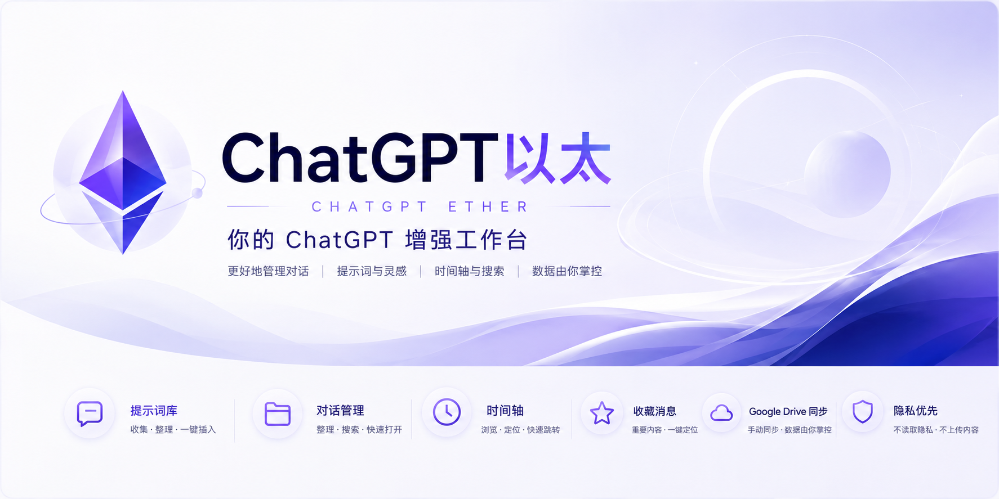

# ChatGPT以太

语言：[English](./README.md) | **中文**



ChatGPT以太是一款面向个人使用的 Chrome 扩展，用来增强 ChatGPT 网页端的对话管理能力。

它不是聊天机器人，也不替代 ChatGPT。本扩展的目标是给 ChatGPT 增加一层轻量的个人工作台：管理提示词、整理对话、收藏关键消息、查看当前对话时间轴，并在需要时把这些元数据同步到你自己的 Google Drive。

> 当前版本：`v1.0 beta`。这是公开 beta 版本，建议先用于个人工作流测试。

## 快速入口

- 官网：<https://chatgpt-ether.shuspace.cn>
- 隐私政策：<https://chatgpt-ether.shuspace.cn/privacy.html>
- 最新下载：<https://github.com/dowevip/chatgpt-ether/releases>
- 源码仓库：<https://github.com/dowevip/chatgpt-ether>

## 主要功能

### 提示词库

- 保存常用提示词
- 搜索提示词
- 标签与收藏
- 一键插入到当前 ChatGPT 输入框
- JSON 导入 / 导出

### 对话管理

- 保存当前 ChatGPT 对话到本地索引
- 使用文件夹整理对话
- 搜索已保存对话
- 给对话添加备注
- 从插件中快速打开已保存对话

### 时间轴与当前对话搜索

- 在 ChatGPT 页面右侧显示当前对话时间轴
- 支持用户消息与助手回复的定位
- 支持当前对话内搜索
- 使用 ChatGPT 页面原生消息标识进行定位，尽量减少误跳转

### 收藏消息

- 收藏当前对话中的重要消息
- 在插件中查看收藏消息
- 点击后打开对应对话并定位到消息附近

### 页面浮动工作台

- ChatGPT 页面内提供一个可拖拽的浮动入口
- 可快速打开提示词库、对话管理、收藏消息
- 可显示或隐藏页面时间轴

### Google Drive 手动同步

- 使用 Google Drive `appDataFolder`
- 支持手动上传到云端
- 支持从云端拉取并合并
- 用于同步提示词、文件夹、对话索引、收藏消息等扩展数据

### 诊断信息

- 查看当前页面识别状态
- 查看当前 conversationId、标题、消息数量
- 查看时间轴、收藏、同步等基础状态
- 一键复制诊断信息，方便排查问题

## 不做什么

ChatGPT以太刻意保持边界清晰：

- 不调用 ChatGPT 私有 API
- 不读取 cookies
- 不读取浏览历史
- 不申请 `all_urls`
- 不上传完整聊天正文
- 不同步完整聊天正文
- 不自动扫描所有历史对话
- 不删除或隐藏 ChatGPT 原生对话
- 不伪装成 OpenAI 官方产品

## 安装方式：下载 Release 包

当前版本暂未上架 Chrome Web Store。推荐从 GitHub Releases 下载 Chrome 扩展压缩包，并以“未打包扩展”的方式加载。

1. 打开 [Releases 页面](https://github.com/dowevip/chatgpt-ether/releases)
2. 下载最新版中的 Chrome 扩展压缩包
3. 解压压缩包
4. 打开 `chrome://extensions/`
5. 开启右上角“开发者模式”
6. 点击“加载已解压的扩展程序”
7. 选择解压后的扩展文件夹

## 从源码构建

如果你想自己构建扩展，可以使用下面的方式。

### 1. 克隆仓库

```bash
git clone https://github.com/dowevip/chatgpt-ether.git
cd chatgpt-ether
```

### 2. 安装依赖

如果你已经安装 Bun：

```bash
bun install
```

如果没有全局安装 Bun，也可以使用：

```bash
npx --yes bun@latest install
```

### 3. 构建 Chrome 扩展

```bash
bun run build:chrome
```

或：

```bash
npm run build:chrome
```

构建成功后会生成：

```text
dist_chrome
```

### 4. 加载到 Chrome

1. 打开 `chrome://extensions/`
2. 开启右上角“开发者模式”
3. 点击“加载已解压的扩展程序”
4. 选择项目中的 `dist_chrome` 目录

## 更新方式

如果你使用 Release 包安装，下载新版压缩包、解压后，在 `chrome://extensions/` 中重新加载新的文件夹。

如果你是从源码构建：

```bash
git pull origin main
npm run build:chrome
```

然后回到 `chrome://extensions/`，点击 ChatGPT以太卡片上的“重新加载”。

## Google Drive 同步说明

Google Drive 同步目前是手动功能。

同步数据包括：

- 提示词库
- 文件夹结构
- 对话索引
- 对话备注
- 收藏消息元数据
- 插件设置
- 必要的时间元数据

不会同步：

- 完整聊天正文
- 助手完整回复
- 附件
- 图片
- Canvas 内容
- 截图
- 大型原始 conversation JSON

同步文件存放在你自己的 Google Drive `appDataFolder` 中，不会出现在普通 Drive 文件列表里。

## 隐私说明

ChatGPT以太会在当前打开的 ChatGPT 页面中读取必要的页面结构，用于生成时间轴、当前对话搜索、消息定位和诊断信息。

扩展数据默认保存在浏览器本地存储中。只有当你主动使用 Google Drive 同步时，允许同步的数据才会上传到你自己的 Google Drive。

本扩展不会出售用户数据，不会把完整聊天正文上传到第三方服务，也不会读取 cookies 或浏览历史。

详细隐私说明见：

- 在线版：<https://chatgpt-ether.shuspace.cn/privacy.html>
- 仓库版：[PRIVACY.zh-CN.md](./PRIVACY.zh-CN.md)

## 当前状态

当前版本是 `v1.0 beta`，适合个人使用和小范围测试。

已完成的核心能力包括：

- Prompt Vault
- Conversation Manager
- Timeline
- Current Conversation Search
- Starred Messages
- Google Drive Manual Sync
- Diagnostics
- Floating Workspace
- zh / en 语言切换

仍建议在正式公开推广前继续观察：

- 长对话性能
- ChatGPT 页面结构变化后的兼容性
- Google OAuth 授权体验
- Google Drive 多设备同步边界

## 开发命令

```bash
npm run build:chrome
npm run dev:chrome
npm run typecheck
npm run test
```

常用构建输出：

```text
dist_chrome
```

## 许可证

本项目基于 GPL-3.0 许可证发布。详见 [LICENSE](./LICENSE)。

## 致谢

ChatGPT以太基于 [Nagi-ovo/gemini-voyager](https://github.com/Nagi-ovo/gemini-voyager) 改造而来，并保留相应开源署名。

时间轴定位思路也受到 [Reborn14/chatgpt-conversation-timeline](https://github.com/Reborn14/chatgpt-conversation-timeline) 启发。

更多说明见：

- [CREDITS.zh-CN.md](./CREDITS.zh-CN.md)
- [NOTICE.zh-CN.md](./NOTICE.zh-CN.md)
